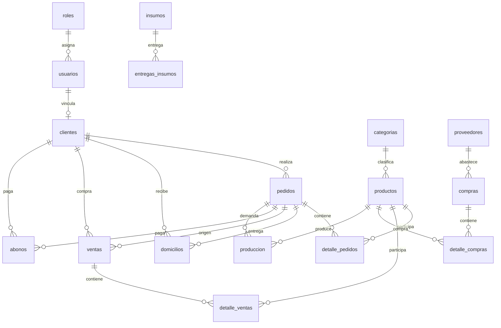

# Estado Actual de Flujo (Analisis Profundo)

Fecha: 2026-04-28  
Proyecto: Grandma's Liquors

## 1. Objetivo

Documentar el flujo real de operacion de la aplicacion (frontend + backend + base de datos), validando:

- Flujo correcto de funcionamiento (camino feliz).
- Quiebres de uso (errores, bloqueos de negocio, inconsistencias potenciales).
- Contratos operativos de endpoints (entrada/salida) y su impacto en tablas.

Este documento se basa en evidencia directa de codigo en:

- `backend/src/routes/*.js`
- `backend/src/controllers/*.controllers.js`
- `backend/src/models/entities.models.js`
- `backend/db.sql`
- `src/App.tsx`
- `src/components/AuthContext.tsx`
- `src/services/api.ts`

---

## 2. Arquitectura Operativa Actual

## 2.1 Frontend

- SPA en React + TypeScript.
- Carga de paginas por lazy loading y control de navegacion por permisos (`hasPermission`).
- Sesion recuperada con `auth.me()` al iniciar.
- Si API devuelve 401, el frontend limpia usuario y cierra contexto de sesion.

## 2.2 Backend

- API REST con Express.
- Casi todas las rutas pasan por `authenticateJWT`.
- Controladores por modulo, modelos centralizados en `entities.models.js`.
- Regla central: la logica de negocio mas critica vive en modelos (validaciones, transiciones, auditorias, transacciones).

## 2.3 Base de datos

- PostgreSQL con tablas transaccionales (pedidos, compras, ventas, domicilios), maestras (roles, usuarios, productos, categorias, proveedores, clientes) y auxiliares (auditoria, sesiones, intentos login).
- Integridad por FK + reglas de estado en capa de aplicacion.

---

## 3. Flujo Global Correcto (Camino Feliz)

```mermaid
flowchart LR
  A[Login] --> B[/api/auth/login]
  B --> C[(usuarios)]
  B --> D[(usuarios_sesiones)]
  B --> E[Permisos por rol]

  E --> F[Compras]
  E --> G[Produccion]
  E --> H[Ventas]

  F --> F1[/api/compras + detalle_compras]
  F1 --> P[(productos stock)]

  H --> H1[/api/pedidos + detalle_pedidos]
  H1 --> H2[Estado pedido: Completado]
  H2 --> H3[/api/domicilios auto]
  H3 --> H4[Estado domicilio: Entregado]
  H4 --> H5[/api/ventas auto + detalle_ventas]
  H --> H6[/api/abonos]

  G --> G1[/api/produccion]
  G --> G2[/api/insumos]
  G --> G3[/api/entregas-insumos]
```

### 3.1 Flujo de autenticacion

1. Frontend llama `POST /api/auth/login`.
2. Backend valida intentos (`usuarios_login_intentos`) y credenciales (`usuarios.password_hash`).
3. Si es valido:
   - Registra sesion en `usuarios_sesiones`.
   - Emite JWT con `rol`, `rol_id`, `cliente_id`.
   - Devuelve permisos del rol (`roles.permisos`).
4. Frontend habilita rutas segun permisos.

### 3.2 Flujo comercial principal

1. Cliente crea pedido (`pedidos`).
2. Agrega productos (`detalle_pedidos`).
3. Al pasar pedido a `Completado`, se autogenera domicilio (`domicilios`) desde backend.
4. Al pasar domicilio a `Entregado`, se autogenera venta (`ventas`) y sus lineas (`detalle_ventas`).
5. Abonos se registran en `abonos` contra pedido/cliente.

### 3.3 Flujo de abastecimiento

1. Se crea compra (`compras`, estado inicial `Pendiente`).
2. Se agregan productos (`detalle_compras`) con validacion de precio contrato.
3. Al pasar compra a `Recibida`, backend incrementa stock de `productos` en transaccion.
4. Cada cambio de estado queda en `compras_estado_historial`.

### 3.4 Flujo de produccion

1. Se crea orden en `produccion` (estado inicial normalizado).
2. Se consume/relaciona informacion de insumos y entregas.
3. Transiciones validas:
   - `Orden Recibida -> Orden en preparacion -> Orden Lista`
   - Cancelacion permitida desde etapas intermedias con motivo.

---

## 4. Endpoints por Modulo (Contrato Operativo Resumido)

## 4.1 Auth (`/api/auth`)

- `POST /login`: `{ email, password, rememberMe? }` -> user + permisos + metadatos de sesion.
- `GET /me`: reconstruye sesion vigente.
- `POST /logout`, `POST /logout-all`: revoca sesiones.
- `POST /change-password`: valida fuerza y historial ultimas 3.
- `POST /password-reset-request`, `POST /password-reset-confirm`.
- `POST /register-cliente`: crea `usuarios` + vincula/crea `clientes`.

## 4.2 Usuarios y Roles

- Usuarios (`/api/usuarios`): CRUD + estado + rol + historial + impacto eliminacion + reset forzado.
- Roles (`/api/roles`): CRUD + permisos + auditoria.

## 4.3 Catalogo y abastecimiento

- Categorias (`/api/categorias`): CRUD + cambio de estado con motivo.
- Productos (`/api/productos`): CRUD + estado con motivo.
- Proveedores (`/api/proveedores`): CRUD + estado con motivo + historial + pendientes.
- Compras (`/api/compras`): CRUD + add producto + update estado con historial y ajuste de stock.

## 4.4 Ventas y postventa

- Clientes (`/api/clientes`): CRUD + busquedas + `usuario/:usuarioId` + `perfil/foto`.
- Pedidos (`/api/pedidos`): CRUD + add producto + auto domicilio por estado.
- Domicilios (`/api/domicilios`): CRUD + auto venta por estado.
- Ventas (`/api/ventas`): CRUD + add producto + filtros por cliente.
- Abonos (`/api/abonos`): CRUD + consulta por pedido.

## 4.5 Produccion

- Insumos (`/api/insumos`): CRUD.
- Entregas insumos (`/api/entregas-insumos`): CRUD.
- Produccion (`/api/produccion`): CRUD + update de estado con transiciones permitidas.

---

## 5. Mapa de Relaciones DB (Negocio)



---

## 6. Quiebres de Uso (Profundo)

Esta seccion enumera quiebres reales detectados en codigo y su efecto operativo.

## 6.1 Quiebres de negocio (bloqueos esperados)

1. Desactivar proveedor con compras pendientes.
- Condicion: proveedor -> `Inactivo` con compras `Pendiente`.
- Resultado: 409, bloqueo por integridad operativa.
- Evidencia: `Proveedores.updateStatus`, `Proveedores.update`.

2. Desactivar usuario con sesion activa sin `force`.
- Condicion: `PUT /usuarios/:id/estado` a `Inactivo` con sesiones activas.
- Resultado: 409 con `activeSessions`.
- Evidencia: `Usuarios.updateStatus`.

3. Eliminacion fisica de usuario antes de 90 dias inactivo.
- Condicion: `mode=physical` sin cumplir ventana de retencion.
- Resultado: 409.
- Evidencia: `Usuarios.delete`.

4. Desactivar rol con usuarios asignados.
- Condicion: `roles.estado = Inactivo` y conteo usuarios > 0.
- Resultado: 400.
- Evidencia: `Roles.update`.

5. Cambio de estado de compras invalido.
- Condicion: estado fuera de `Pendiente|Recibida|Cancelada`.
- Resultado: 400.
- Evidencia: `Compras.updateStatus`.

6. Compra ya recibida no modificable por estado.
- Condicion: intentar cambiar estado cuando ya es `Recibida`.
- Resultado: 409.
- Evidencia: `Compras.updateStatus`.

7. Cancelar compra sin motivo suficiente.
- Condicion: `Cancelada` con motivo < 10 caracteres.
- Resultado: 400.
- Evidencia: `Compras.updateStatus`.

8. Produccion con transicion invalida.
- Condicion: saltos no permitidos o cambio desde `Orden Lista`/`Cancelada`.
- Resultado: 400/409.
- Evidencia: `Produccion.updateStatus`.

9. Rol Cliente con permisos no permitidos.
- Condicion: permisos fuera de whitelist o lista vacia.
- Resultado: 400.
- Evidencia: `validatePermissionsPayload`.

## 6.2 Quiebres de datos (consistencia)

1. Pedidos sin validaciones fuertes en modelo.
- Hallazgo: `Pedidos.create/update/addDetalle` no valida cantidades positivas, estado permitido ni stock.
- Riesgo: incoherencias de total/lineas y datos no normalizados.

2. Domicilios update sin validacion de transicion de estado.
- Hallazgo: `Domicilios.update` hace update directo.
- Riesgo: estado arbitrario desde cliente interno/admin UI.

3. Abonos sin regla de saldo contra pedido.
- Hallazgo: `Abonos.create/update` no limita monto acumulado vs total pedido.
- Riesgo: sobrepago logico sin bloqueo.

4. CRUD de insumos/entregas sin controles de negativos.
- Hallazgo: no hay validacion de valores minimos en modelo.
- Riesgo: inventario invalido.

5. Categorias/productos delete directo.
- Hallazgo: delete directo; depende totalmente de FK/DB.
- Riesgo: errores SQL visibles a usuario cuando hay referencias.

## 6.3 Quiebres de UX/flujo entre frontend y backend

1. Mapeo de permiso cliente historico duplicado.
- Hallazgo: existen `Ver Mis Lista de Compras` y `Ver Mis Compras`.
- Riesgo: desalineacion semantica de permisos/menus entre versiones.

2. Fallback de navegacion por permisos.
- Hallazgo: frontend calcula ruta fallback; puede abrir modulo distinto al esperado tras cambio de rol.
- Riesgo: percepcion de "salto" de pantalla al iniciar sesion.

3. Dependencia de normalizacion en frontend y backend.
- Hallazgo: ambos normalizan estado/metodos.
- Riesgo: divergencia futura si se modifica uno sin el otro.

## 6.4 Quiebres de seguridad y operacion

1. `DELETE` fisico habilitado por payload.
- Hallazgo: si se envia `mode=physical` y validaciones omitibles (`omit_validaciones`), se amplifica riesgo operativo.
- Mitigacion actual: motivo obligatorio + reglas por defecto.
- Riesgo residual: abuso por actor privilegiado.

2. Auditoria "best effort" en usuarios.
- Hallazgo: `registerUserAudit` captura error y no interrumpe.
- Ventaja: disponibilidad.
- Riesgo: brechas de trazabilidad en fallos de tabla auditoria.

---

## 7. Validacion de Flujo Correcto por Macroproceso

## 7.1 Login y sesion

Estado actual: Correcto y robusto.

Fortalezas:
- Rate limit de intentos.
- Sesion con `jti` revocable.
- Expiracion por rol.
- Soporte cookie + bearer.

Riesgo residual:
- No se observa invalidacion automatica de todas sesiones al cambio de password (recomendable evaluar politica).

## 7.2 Compra e inventario

Estado actual: Correcto con buena integridad.

Fortalezas:
- Compra fuerza proveedor activo.
- Detalle valida max 50 productos, precio contrato, producto activo.
- Recepcion incrementa stock en transaccion.
- Historial de estados persistido.

Riesgo residual:
- Regla de umbral `>= 10000` embebida en modelo, no parametrizada.

## 7.3 Pedido -> domicilio -> venta

Estado actual: Correcto en automatizacion.

Fortalezas:
- Auto domicilio por pedido completado.
- Auto venta por domicilio entregado.
- Restriccion cliente para leer/editar solo lo propio.

Riesgo residual:
- Falta validacion fuerte de estructura/estado en modelo de `Pedidos` y `Domicilios`.

## 7.4 Produccion

Estado actual: Correcto en estado y transiciones.

Fortalezas:
- Validacion de payload (producto, cantidad, fecha, tiempo).
- Transiciones controladas y bloqueos por estado terminal.

Riesgo residual:
- Relacion de `insumos_gastados` con inventario no descuenta stock automaticamente.

---

## 8. Matriz de Riesgo (Prioridad)

| ID | Riesgo | Severidad | Probabilidad | Impacto |
|---|---|---|---|---|
| R1 | Pedidos sin validacion de detalle/estado en modelo | Alta | Media | Alta |
| R2 | Abonos sin tope contra total pedido | Alta | Media | Alta |
| R3 | Domicilios sin transicion de estado validada en modelo | Alta | Media | Media |
| R4 | Inconsistencia de normalizacion frontend/backend | Media | Media | Media |
| R5 | Operacion fisica de borrado por payload | Media | Baja | Alta |
| R6 | Auditoria best effort puede perder trazas | Media | Baja | Media |
| R7 | Umbral de aprobacion compras hardcoded | Baja | Media | Media |

---

## 9. Recomendaciones de Endurecimiento (A fondo)

1. Llevar reglas de `Pedidos`, `Domicilios`, `Abonos`, `Insumos` al nivel de validacion fuerte en modelo (como ya existe en `Compras` y `Produccion`).
2. Implementar maquina de estados explicita para `Pedidos` y `Domicilios` en modelo.
3. En `Abonos`, validar saldo pendiente por pedido antes de insertar/actualizar.
4. Parametrizar reglas de negocio en config (ej. umbral de aprobacion de compras).
5. Centralizar diccionario de estados/metodos para evitar doble normalizacion FE/BE.
6. Añadir tests de regresion de flujo:
   - Pedido completado => domicilio creado.
   - Domicilio entregado => venta creada.
   - Compra recibida => stock incrementado.
   - Usuario inactivo con sesion activa => bloqueo sin force.
7. Endurecer eliminacion fisica de usuarios con politica adicional por rol/permiso explicitamente dedicado.

---

## 10. Estado Ejecutivo

- Flujo principal actual: funcional y bien estructurado.
- Madurez alta en autenticacion, compras, produccion y auditoria.
- Deuda tecnica focalizada en validaciones profundas de pedidos/domicilios/abonos e inventario de insumos.
- Prioridad recomendada: cerrar R1, R2, R3 para elevar consistencia operativa y reducir incidencias de datos.

---

## 11. Anexo: Endpoints Base Validados

- `/api/auth`
- `/api/usuarios`
- `/api/roles`
- `/api/clientes`
- `/api/proveedores`
- `/api/compras`
- `/api/productos`
- `/api/categorias`
- `/api/pedidos`
- `/api/ventas`
- `/api/abonos`
- `/api/domicilios`
- `/api/insumos`
- `/api/entregas-insumos`
- `/api/produccion`
